# Setup Docsify with Podman and intergrate with Github Docsify

Docsify is a lightweight, flexible, and easy-to-set-up documentation generator that can turn your
Markdown documentation into a website.
#### Linux Distribution:

Distributor ID: Ubuntu
Version: 23.04

#### systemConfiguration:
RAM : 4GB
CPU : 4 CORE
STORAGE : 1TB
#### What is Podman

The full form of podman is pod manager tool and that's why the name is podman
The name pods came from the kubonities. Collection of containers or Grouping of containers are
called as pods
The main reason for creating podman is to lavering the concept of pods where u have two
containers run together mostly called them as a side car patterns . Soo We can use podman to
run two different containers together.
#### What is Github

GitHub is an online software development platform. It's used for storing, tracking, and collaborating on
software projects.
#### STEP 1 - Update Your System
sudo apt update
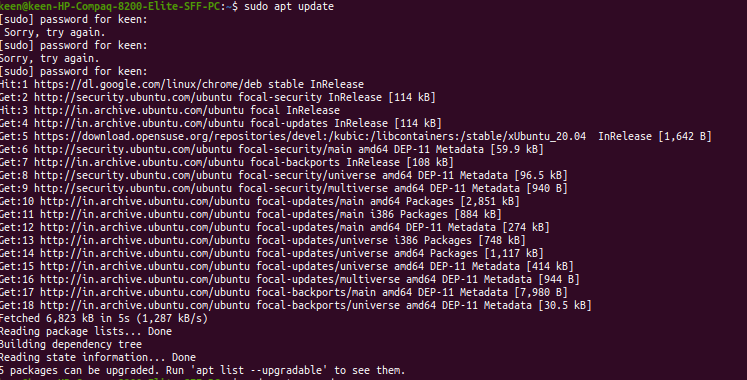
### STEP 2 - Podman Installation
sudo apt-get install -y podman

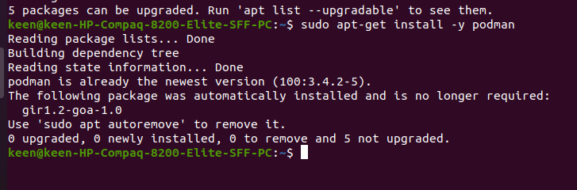

**sudo** : This part of the command is like saying "I want to do something important." It stands for
"superuser do" and allows you to perform tasks that affect your computer's system, like installing
software.

**apt-get**: Think of this as a magic tool that helps you add, update, and remove programs (software)
on your computer. It's how you manage what software is installed.
**- install**: This tells the magic tool that you want to put a new program on your computer.
**- -y: The -y is like saying**, "Yes, go ahead!" It tells the magic tool to answer "Yes" to any questions it
might ask during the installation, so you don't have to type "Yes" manually.
**- Check Podman Version**

podman --version

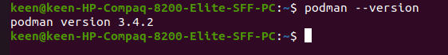
**podman**: This is the name of the program or tool
**- When you run podman** --version, Podman responds by showing you a number (e.g., "2.2.1"). This
number represents the version of Podman that's currently installed. Knowing the version is helpful
because different versions might have different features or behave in slightly different ways, so it's
useful information if you're troubleshooting or working with Podman.
#### STEP 4 - Create a Directory

mkdir Directory

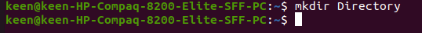

**- mkdir:** This is a command that stands for "make directory." It tells your computer that you want to
create a new folder.

#### STEP 5 - Create File In Directory
touch index.html
touch Dokerfile
touch README.md

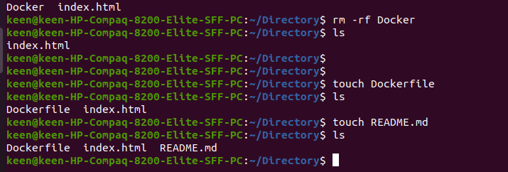

**- touch:** This is a command that tells your computer to create a new file.

#### STEP 6 - Open/Edit and paste the index.html syntex
vim index.html

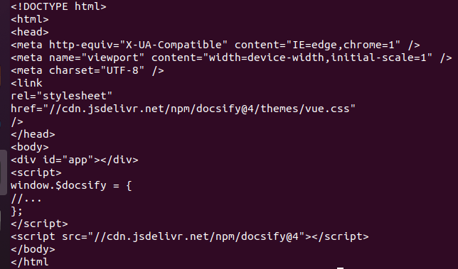

**- vim:** This is the command to launch the Vim text editor.

#### STEP 7 - Open/Edit and paste the Dockerfile

vim Dockerfile

FROM node:latest
LABEL description="A demo Dockerfile for build Docsify."
WORKDIR /docs
RUN npm install -g docsify-cli@latest
EXPOSE 3000/tcp
ENTRYPOINT docsify serve .

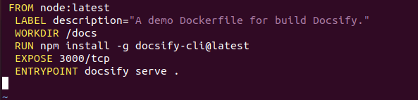

#### STEP 8 - Write something you want to write in README.md file

vim README.md

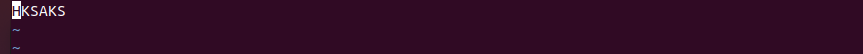
#### STEP 9 - Podmab build image
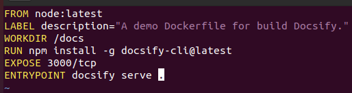

**Podman build image**" in simple words means creating a container image using Podman, which is a
tool for managing containers (like virtualized software environments). Here's a breakdown:
- **Podman**: This is the tool you're using. It's similar to Docker and helps you work with containers.
 **Build:** This means you're instructing Podman to build something. In this case, you're telling it to
construct a container image.
**- Image**: An image is like a snapshot of a software application and its dependencies. It's a blueprint
that can be used to create and run containers. Think of it as a package containing everything needed
to run a piece of software.

 **STEP 10 - Podman run**
 podman run -d -p 3000:3000 -v/home/keen/docs localhost/docsify/demo

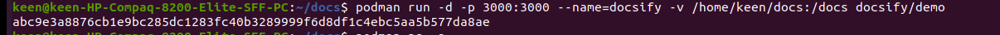

**run:** This part of the command tells Podman that you want to start and run a container with a specific
image.
**STEP 11** - Container Check

podman ps -a

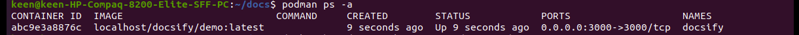

**- ps:** This stands for "process status." It's a command that helps you see information about the
programs and tasks currently running on your computer.

**-a:** This is an option or flag that you add to the "ps" command. It tells "ps" to display information about
all processes, not just the ones associated with your current terminal session.

#### STEP 12 - Preview
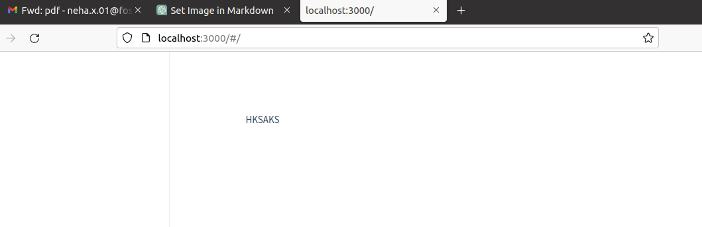

#GITHUB

**STEP:1**

Create a github account and make a repository. To create a GitHub account Go to https://github.com/ Click on "Sign up" and follow the prompts to create your account then Login github
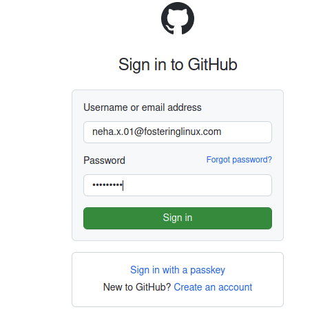

#### STEP:2

Create GitHub Repository

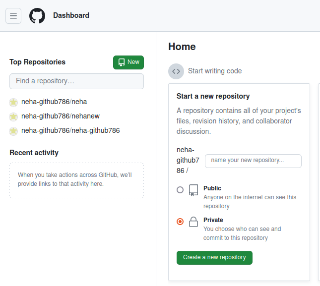

Choose a name for your repository. Then Write a short description about your project or documentation. Choose whether the repository should be public or private. Then click create a repository.

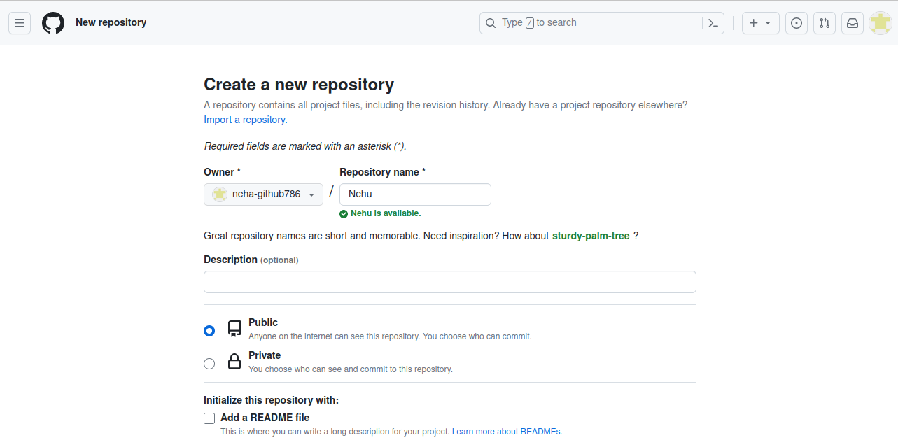

#### STEP:3

**create a new repository on the command line**

git init :- "git init" is like setting up a magic box that remembers all the changes you make to your files, so you can easily go back and see what you did later.
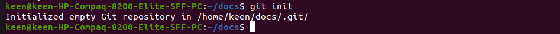
**git add README.md **:- Command is used to tell Git that you want to include the changes you've made to the README.md file.

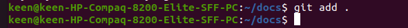

**git commit -m "first commit"** :- Is like saving your work and adding a quick note to remember what you did. It's like taking a snapshot and writing a caption for it.

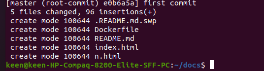

**git branch -M master** :- (git branch) This tells Git you want to work with branches, which are different versions of your project.(M) This is a flag that means you're renaming or moving a branch.(master) This is the name of the branch you're renaming. In Git, "master" is often the default starting point.

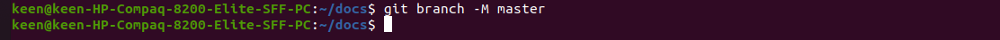

**git remote add origin** https://github.com/neha-github786/Nehu This command is saying, "Git, I want to connect my local project to a place on GitHub called 'origin' using this web address.

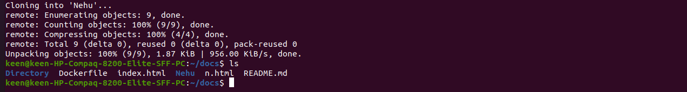

**STEP:4**

#### Generate a token to be used as a password when executing the git push -u origin master command.

.Open setting

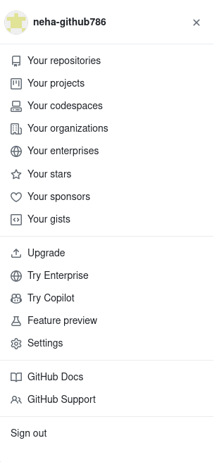

.Select Developer settings

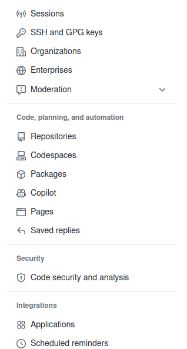

Select Personal access token (Classic version)

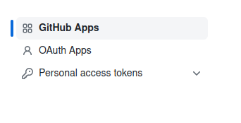

.Click generate new token

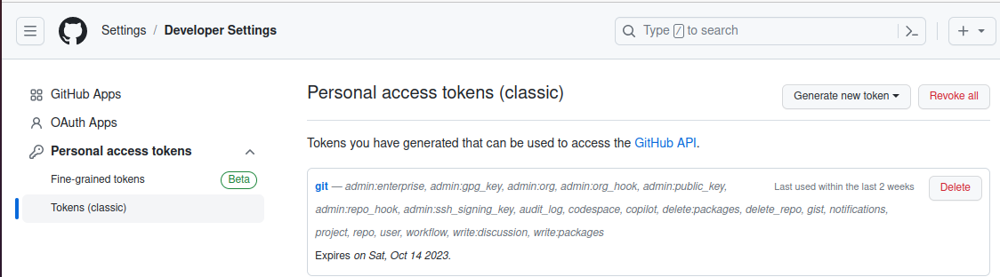

**STEP: 5**

Clone the Repository

**git push -u origin master**:- Is like sending your local work to your online project's home on GitHub. It's a way to share your changes and keep everything in sync. The -u part helps set up a
connection for next time.

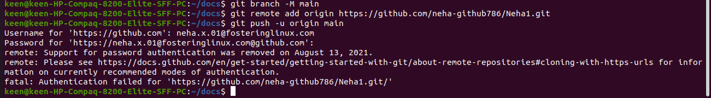

